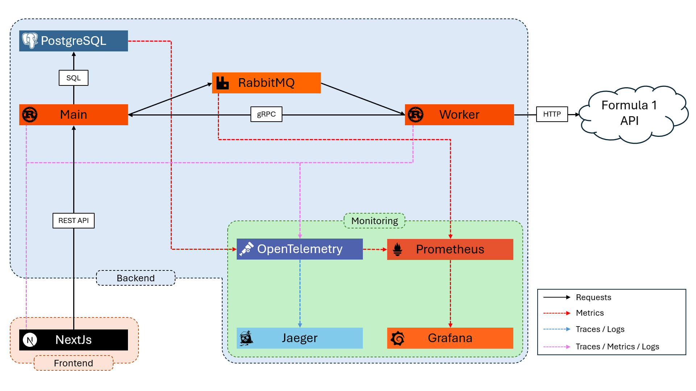

#  MetricsOne

[](https://rust-lang.org/)
[](https://nextjs.org/)
[](https://www.docker.com/)
[](LICENSE)

A distributed Rust + Next.js platform for analyzing and visualizing Formula 1 data with full observability.

## 🔍 Overview

**MetricsOne** is a web tool designed to analyze Formula 1 data based on a distributed architecture in **Rust**. 
A **Worker** service retrieves data from [formula1.com](https://formula1.com/) and sends it to the **Main service** through **gRPC**. 
The main service communicates with the worker asynchronously through **RabbitMQ**, populates a **PostgreSQL** database, and exposes the data through a **REST API**.
This data can then be viewed from a **Next.js** interface (React + TypeScript). 
The entire system is containerized with **Docker**, instrumented with **OpenTelemetry** and **Prometheus**, and monitored via **Grafana** and **Jaeger**.

## 🧰 Architecture


<sub>*MetricsOne high-level architecture*</sub>


### Global workflow 

1. The user interacts with MetricsOne through a **Next.js** frontend (built with **React** and **TypeScript**), which sends **HTTP requests** to the **Main service** (Rust).
2. To fulfill the requests, the **Main service** retrieve data from the **PostgreSQL** database.
3. If needed, using **RabbitMQ**, the **Main service** can asynchronously request the **Worker (Rust)** to retrieve data from [formula1.com](https://formula1.com/).
4. Once the data is retrieved, the **Worker** can request the **Main service** through **gRPC** to insert or update the **PostgreSQL** database.

### Traces, Logs and Metrics collection

Both the backend (Main service and Worker) and the frontend are instrumented with **OpenTelemetry**.
Thus, each component exports **Traces**, **Logs** and **Metrics** to the **OpenTelemetry Collector**.

Full trace propagation is supported across:
- HTTP requests (Frontend -> Main service)
- RabbitMQ messages (Main service -> Worker)
- gRPC requests (Worker -> Main service)

For the other components, OpenTelemetry periodically scrapes PostgreSQL for Metrics.
Then, Prometheus periodically scrapes the OpenTelemetry Collector and RabbitMQ for all Metrics.

Finally, Jaeger requests Traces and Logs from the OpenTelemetry Collector and Grafana requests Metrics from Prometheus.
This provides a convenient interface to observe and monitor the whole system.

## 🧱 Repository Structure

Structure of the repository with sub-repositories and containers:
```
MetricsOne (Main repository)
├── MetricsOne-Backend (Sub-repository)
│   ├── API (Rust)
│   ├── Worker (Rust)
│   ├── PostgreSQL
│   ├── RabbitMQ 
│   ├── OpenTelemetry 
│   ├── Prometheus
│   ├── Grafana
│   └── Jaeger
└── MetricsOne-Frontend (Sub-repository)
    └── Next.js
```

## 🚀 Getting Started

1. Clone the repository 
    ```bash
    git clone --recurse-submodules https://github.com/EdouardDidier/MetricsOne.git
    cd MetricsOne
    ```
2. Create a `.env` file 
    ```bash
    cp .env.example .env
    ```
   Edit it to set your environment variables. 

3. Run the backend (required to build the frontend) 
    ```bash
    docker compose up -d
    ```
4. Run the frontend 
    ```bash
    docker compose up -d
    docker compose --profile web up -d
    ```
5. Access the web interface at [http://localhost:3000](http://localhost:3000)

## 📊 Monitoring & Observability

### Traces and Logs

Traces and logs are collected by an OpenTelemetry Collector and can be observed through Jaeger. 
By default, Jaeger is available at [http://localhost:16686](http://localhost:16686).

[Jaeger Example](docs/ExampleJaeger.png)
<sub>*Example of Traces and Logs in Jaeger*</sub>

### Metrics

Metrics are collected by Prometheus through an OpenTelemetry Collector or directly and can be observed through Prometheus requests or Grafana dashboards.
By default, Prometheus is available at [http://localhost:9090](http://localhost:9090) and Grafana is available at [http://localhost:3010](http://localhost:3010) (User and Password are defined in the `.env` file).

## 🧩 Dependencies

- [Rust](https://www.rust-lang.org/)
    - [Actix-web](https://actix.rs/) to handle incoming HTTP requests
    - [Tokio](https://tokio.rs/) for asynchronous programming
    - [SQLx](https://github.com/launchbadge/sqlx) to prepare and execute SQL queries
    - [Tonic](https://github.com/hyperium/tonic) and [Prost](https://github.com/tokio-rs/prost) to handle gRPC requests and 
    - [Lapin](https://github.com/amqp-rs/lapin) for interactions with RabbitMQ
    - [Tracing](https://github.com/tokio-rs/tracing) for instrumentation
    - [Reqwest](https://github.com/seanmonstar/reqwest) for external HTTP requests
    - [Serde](https://serde.rs/) and [Bincode](https://sr.ht/~stygianentity/bincode/) for serialization and deserialization
- [PostgreSQL](https://www.postgresql.org/)
- [RabbitMQ](https://www.rabbitmq.com/)
- [OpenTelemetry](https://opentelemetry.io/)
- [Prometheus](https://prometheus.io/)
- [Grafana](https://grafana.com/)
- [Jaeger](https://www.jaegertracing.io/)
- [Next.js](https://nextjs.org/)
    - [React](https://react.dev/)
    - [TypeScript](https://www.typescriptlang.org/)
- [Docker](https://www.docker.com/)

## 📝 Resources

All images and data retrieved by the application are from [formula1.com](https://formula1.com/).
